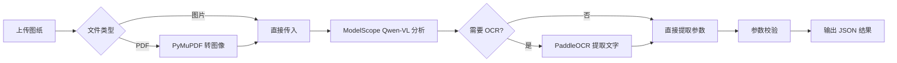

# Drawing Parser ADK

基于 **Google ADK** 和 **ModelScope Qwen-VL** 的工程图纸智能识别系统，支持自动提取图纸参数、OCR 文字识别和 PDF 转换。

## ✨ 核心功能

- 🎯 **多模态图纸分析**：支持机械图/电气图/建筑图等多种工程图纸类型
- 📄 **PDF 自动转换**：无需手动处理，上传 PDF 自动转为高清图像
- 🔍 **PaddleOCR 集成**：智能提取图纸上的文字标注和尺寸信息
- 🌐 **Web 界面**：通过 ADK Web 提供友好的交互式分析界面
- 🔧 **参数验证**：自动校验提取结果的完整性和置信度
- 📊 **结构化输出**：返回标准 JSON 格式，包含参数名、值、单位、置信度

## 🏗️ 技术架构

- **Agent 框架**：Google Agent Development Kit (ADK)
- **多模态模型**：ModelScope Qwen3-VL-235B-A22B-Instruct
- **OCR 引擎**：PaddleOCR (中英文混合识别)
- **PDF 处理**：PyMuPDF (fitz)
- **API 协议**：OpenAI 兼容接口 (LiteLLM)

## 📦 安装依赖

### 1. 基础环境
```bash
pip install python-dotenv
pip install google-adk
pip install litellm
```

### 2. OCR 相关
```bash
pip install paddlepaddle paddleocr opencv-python-headless
```

### 3. PDF 处理
```bash
pip install pymupdf  # 无需安装系统级 poppler
```

## 🚀 快速开始

### 1. 配置环境变量

在项目根目录创建 `.env` 文件：

```env
# ModelScope API Key (必需)
MODELSCOPE_API_KEY=your_modelscope_api_key_here

# 日志目录 (可选，默认为 ./logs)
ADK_LOG_DIR=~/tmp/agents_log
```

> 💡 获取 API Key：访问 [ModelScope](https://www.modelscope.cn/) 注册账号并创建 API Key

### 2. 启动 Web 服务

```bash
cd workspace/google_dk
adk web . --port 8001
```

访问 `http://localhost:8001` 即可使用 Web 界面上传图纸进行分析。

### 3. 使用命令行交互

```bash
cd workspace/google_dk
adk run .
```

## 📝 使用示例

### Web 界面操作

1. 启动服务后，在浏览器打开 `http://localhost:8001`
2. 点击上传按钮，选择工程图纸（支持 JPG/PNG/PDF）
3. Agent 自动分析并返回 JSON 格式结果：

```json
{
  "drawing_type": "机械工程图",
  "title": "轴承座",
  "drawing_number": "ZC-001",
  "scale": "1:2",
  "parameters": [
    {"name": "外径", "value": "100", "unit": "mm", "confidence": 0.95},
    {"name": "内径", "value": "50", "unit": "mm", "confidence": 0.92},
    {"name": "材料", "value": "45#", "unit": "", "confidence": 0.88}
  ]
}
```

## 🛠️ 工具说明

### 1. `extract_text_ocr`
- **功能**：对上传的图纸进行 OCR 识别，提取文字标注
- **使用场景**：当图纸包含大量文字说明或尺寸标注时自动调用
- **引擎**：PaddleOCR (支持中英文混合)

### 2. `validate_parameters`
- **功能**：校验提取的参数列表是否符合规范
- **检查项**：参数完整性、置信度阈值、格式正确性
- **返回**：验证结果和问题列表

## 🔧 核心组件

### ModelScopeLiteLlm
自定义 LiteLlm 类，解决 ModelScope API 的兼容性问题：
- ✅ 自动将 `file_data` 转换为 `inline_data`
- ✅ 支持 Web 上传文件的内存流处理
- ✅ PDF 自动转图像（通过 PyMuPDF）
- ✅ 注入文件路径提示，方便 OCR 工具调用

### DrawingRecognitionAgent
主 Agent 类，封装完整的图纸分析流程：
- 工具注册：OCR、参数验证
- 系统提示：优化的工作流程约束，避免工具调用循环
- 模型配置：ModelScope Qwen-VL + OpenAI 兼容协议

## 📂 项目结构

```
google_dk/
├── drawing_agent_adk.py   # 主 Agent 实现
├── agent.py                # ADK 标准入口
├── config.json             # 图纸模板配置（可选）
├── .env                    # 环境变量（不提交到 Git）
├── .gitignore              # Git 忽略规则
├── temp_uploads/           # 临时上传文件目录
└── logs/                   # 日志文件目录
```

## ⚠️ 注意事项

1. **API 限流**：ModelScope 免费版有请求频率限制，遇到 429 错误请稍后重试
2. **GPU 加速**：PaddleOCR 默认使用 CPU，如需 GPU 加速请修改 `use_gpu=True`
3. **文件路径**：Agent 会自动从上下文中提取文件路径，无需手动指定
4. **工具调用**：系统已优化提示词，OCR 工具最多只调用一次，避免循环

## 🔄 工作流程



## 📄 许可证

MIT License

## 🤝 贡献

欢迎提交 Issue 和 Pull Request！

## 📮 联系方式

如有问题或建议，请通过 GitHub Issues 反馈。
